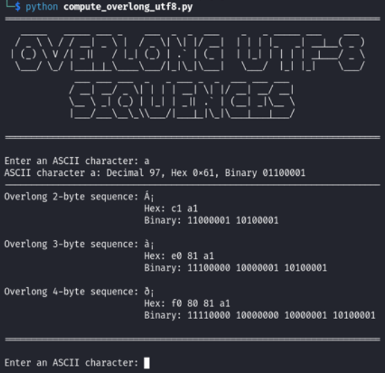

# Compute Overlong UTF-8

This script computes overlong UTF-8 representations of ASCII characters.

## Introduction

An overlong UTF-8 sequence is a non-canonical encoding that uses more bytes than necessary to represent a character.
In standard UTF-8 encoding, an ASCII character (code point from 0 to 127) should be represented in a single byte.
Overlong sequences use two or more bytes for the same character, which is technically invalid according to the Unicode standard.

## Usage

Just download and run with Python 3. The script will ask for a single ASCII character as input and returns its decimal, hexadecimal and binary representation along with overlong 2- to 4-byte UTF-8 sequences.

